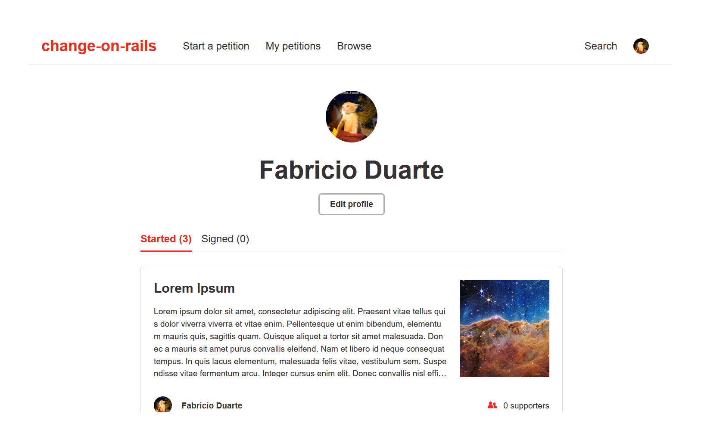

[![MIT License][license-shield]][license-url]
[![LinkedIn][linkedin-shield]][linkedin-url]


<!-- PROJECT LOGO -->
<div align="center">

<h3 align="center">Change on Rails</h3>

  <p align="center">
    Change.org clone made with Ruby on Rails
  </p>
  
   
   
</div>


<!-- TABLE OF CONTENTS -->
<details>
  <summary>Table of Contents</summary>
  <ol>
    <li>
      <a href="#about-the-project">About The Project</a>
      <ul>
        <li><a href="#built-with">Built With</a></li>
      </ul>
    </li>
    <li>
      <a href="#getting-started">Getting Started</a>
      <ul>
        <li><a href="#installation">Installation</a></li>
      </ul>
    </li>
    <li><a href="#license">License</a></li>
    <li><a href="#contact">Contact</a></li>
    <li><a href="#acknowledgments">Acknowledgments</a></li>
  </ol>
</details>


<!-- ABOUT THE PROJECT -->
## About The Project
### Built With

* [](https://rubyonrails.org/)
* [](https://www.sqlite.org/index.html)


<!-- GETTING STARTED -->
## Getting Started
### Installation

1. Clone the repo
   ```sh
   git clone https://github.com/winterhazel/change-on-rails.git
   ```
2. Install dependencies
   ```sh
   bundle
   ```
3. Initialize the database
   ```sh
   rails db:create db:migrate
   ```
4. Serve
   ```sh
   rails s
   ```


<!-- LICENSE -->
## License

Distributed under the MIT License. See `LICENSE.txt` for more information.


<!-- CONTACT -->
## Contact

Fabricio Duarte Júnior - fabricio.duarte.jr@gmail.com


<!-- ACKNOWLEDGMENTS -->
## Acknowledgments

* [Best-README-Template](https://github.com/othneildrew/Best-README-Template)
* [Change.org](https://change.org)
* [Markdown Badges](https://github.com/Ileriayo/markdown-badges)


<!-- MARKDOWN LINKS & IMAGES -->
[license-shield]: https://img.shields.io/github/license/winterhazel/change-on-rails.svg?style=for-the-badge
[license-url]: https://github.com/winterhazel/change-on-rails/blob/master/LICENSE.txt
[linkedin-shield]: https://img.shields.io/badge/-LinkedIn-black.svg?style=for-the-badge&logo=linkedin&colorB=555
[linkedin-url]: https://linkedin.com/in/fabricio-duarte-júnior-676601231/